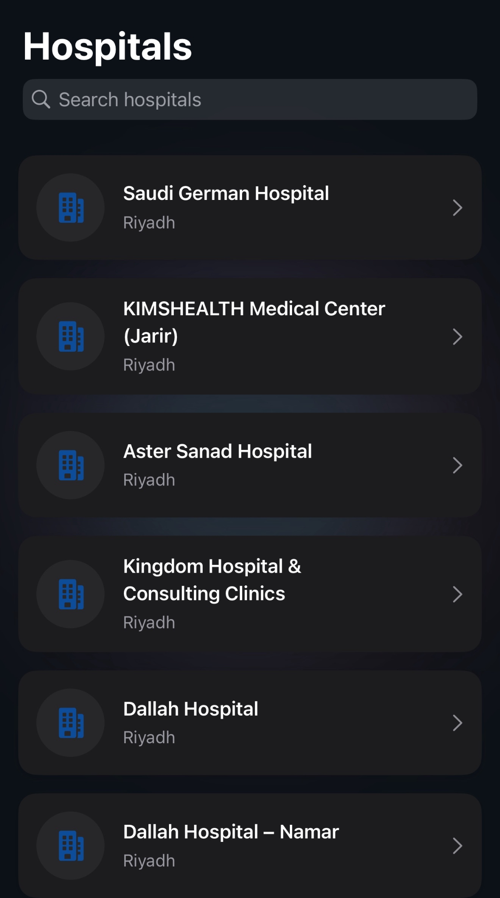
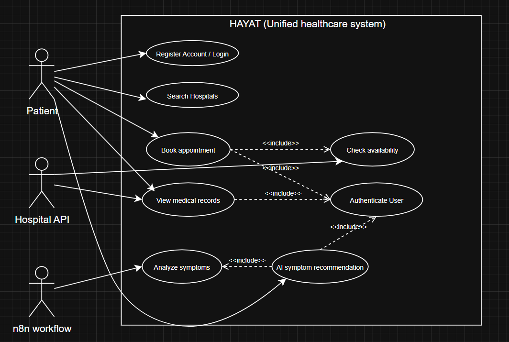
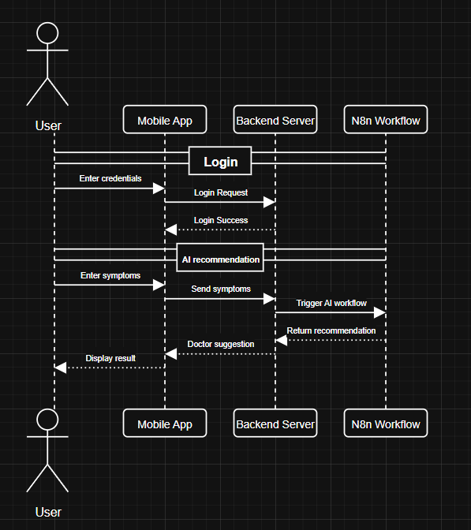
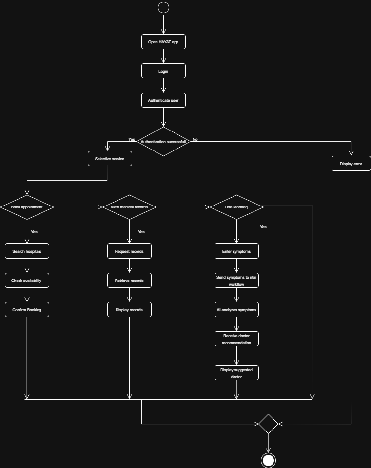
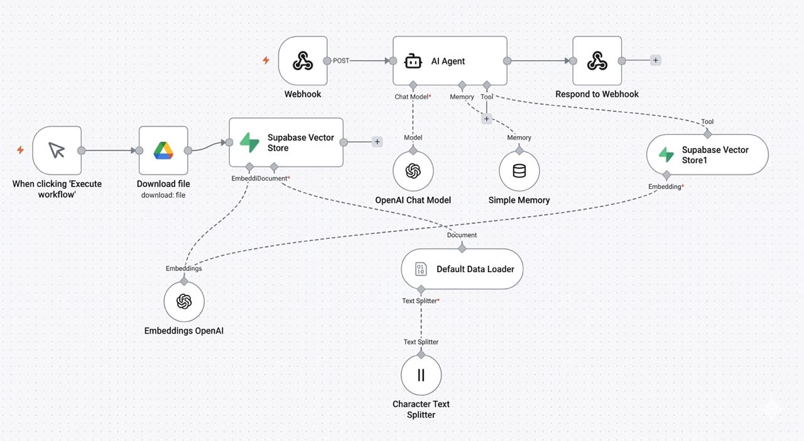
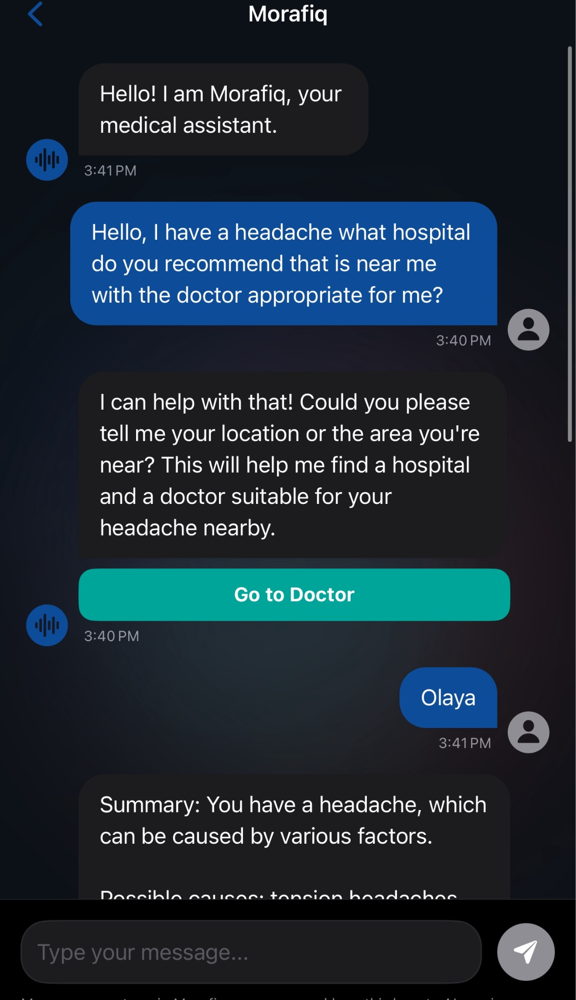
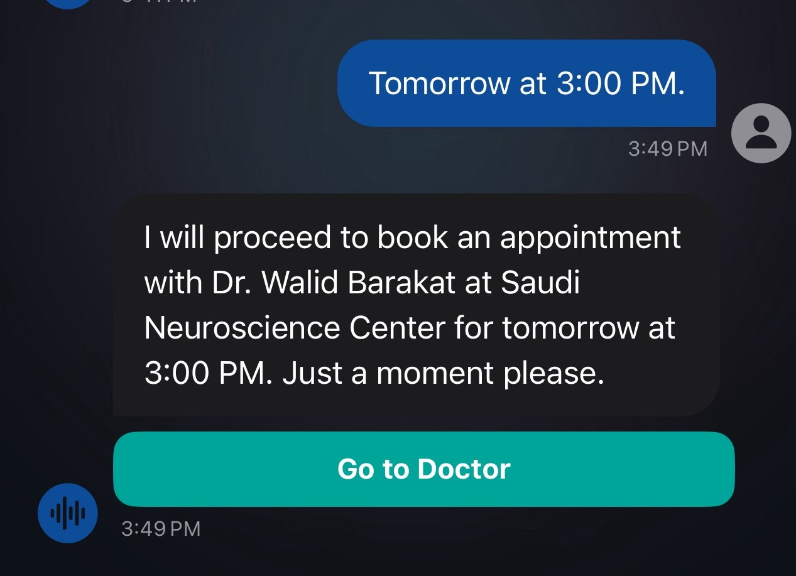
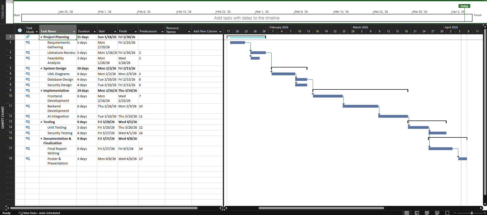

# Hayat (حياة) — Unified Hospital App

**Live on the App Store:** https://apps.apple.com/sa/app/hayat-%D8%AD%D9%8A%D8%A7%D8%A9/id6761381908

Senior project (IS499), Prince Sultan University · Semester 252 · Supervised by Dr. Omaia Al-Omari

**🏆 Best Senior Project — PSU CCIS Expo 2026**

## Overview

Healthcare in Saudi Arabia is spread across hospital systems that don't talk to each other. Patients
juggle separate apps just to book an appointment, see a lab result, or find a prescription — and in an
urgent (but non-emergency) situation, that friction costs time that matters.

**Hayat** is an iOS app that brings hospitals across Riyadh into one place. Patients can search
hospitals and doctors, book appointments, and — through an AI assistant called **Morafiq** — describe
symptoms in Arabic or English and get routed to the right specialty and an available doctor. Pharmacy
access, lab results, prescriptions, and vaccination records are all in the same app, alongside quick
access to emergency services.

## Architecture

Three actors drive the system: the **patient** (search, book, view records, chat with Morafiq), the
**Hospital API** (availability/authentication), and the **n8n workflow** that powers Morafiq's symptom
analysis.

The sequence diagram shows the two core flows: login/authentication, and the AI recommendation loop
(app → backend → n8n workflow → doctor suggestion → booking).

### Morafiq's AI pipeline

Morafiq isn't a hardcoded chatbot — it's a Retrieval-Augmented Generation (RAG) pipeline built in
**n8n**: a webhook receives the user's message, an AI Agent node (OpenAI chat model + short-term
memory) answers using context pulled from a **Supabase vector store**, which is populated from the
project's own medical reference documents (hospital/pharmacy directories — see the source `.pdf`s in
`docs/`). This is why Morafiq can recommend a specific doctor and specialty instead of giving generic
advice.

  
  

*A real conversation: the user describes a headache, Morafiq asks for their area, recommends a
neurologist at a nearby hospital, and books the appointment once a time is confirmed.*

## Features

- **Hospital & doctor search** — browse hospitals and doctor profiles, filter by specialty
- **Appointment booking** — book directly from a doctor's profile or through Morafiq
- **Morafiq AI assistant** — RAG-based chat (Arabic/English) that recommends a specialty, a specific
  doctor, and can complete the booking in the same conversation
- **Health records** — lab/radiology results, medical reports, allergies with severity tracking
- **Medications** — medication list with reminder notifications (`MedicationReminderManager`)
- **Pharmacy directory** — nearby pharmacies with details
- **Insurance** — store insurance provider, policy, and coverage type
- **Emergency** — dedicated emergency screen with a swipe-to-call action
- **Profile & settings** — user profile, privacy policy, help/support

## How it compares

| App | Cross-hospital booking | AI symptom triage | Unified records |
|---|---|---|---|
| Sehhaty | Public sector only | No | Partial |
| Tawakkalna | No (ID/health verification) | No | No |
| Vezeeta | Yes (aggregator) | No | No |
| **Hayat** | **Yes** | **Yes (Morafiq)** | **Yes** |

## Tech stack

- **Swift / SwiftUI** — native iOS app, organized by feature (`App`, `Core`, `Views`, `Models`,
  `Services`, `Components`)
- **Morafiq backend** — n8n automation (Webhook → AI Agent → OpenAI chat model + Supabase vector
  store + memory → response), called from `MorafiqService.swift`; the live endpoint isn't published
  here to avoid exposing a running service
- **MVVM-leaning structure** — `AppState` for shared state, dedicated `*Data.swift` model files per
  domain (hospitals, doctors, pharmacies)

## Team & contributions

| Member | Role |
|---|---|
| Ahmed Almuhanna | Mobile UI/UX design, frontend/backend integration |
| Adam Aljuwayed | Security & privacy engineering |
| Abdulaziz Alabdullatif | AI logic & integration, UML/systems design |
| Nawaf Aljarrah | Project documentation |

All team members contributed to requirements analysis, system design, testing, and the final
presentation.

## Timeline

Six phases from project planning through documentation & final presentation, run January–April 2026.

## Methodology

Built with an Agile-iterative approach: requirements were drawn from a gap analysis of existing
platforms (Sehhaty, Tawakkalna, Vezeeta) and Form A/B project proposals, then implemented and refined
in short iterations with continuous testing (unit, integration, functional) at each stage.

## Evaluation

Testing confirmed the app supports its core flows — appointment booking and AI-based recommendations —
reliably, and early user feedback pointed to improvements in both efficiency and ease of use versus
juggling multiple hospital apps.

## Future work

Integrating with real hospital APIs, improving Morafiq's accuracy with authentic medical data, and
scaling the platform nationwide.

## Docs

- [`docs/Hayat-Documentation.pdf`](docs/Hayat-Documentation.pdf) — full IS499 report (background,
  literature review, architecture, evaluation, references)
- [`docs/Hayat_poster.pptx`](docs/Hayat_poster.pptx) — project poster
- [`docs/SeniorProjectPPT_hayat.pptx`](docs/SeniorProjectPPT_hayat.pptx) — defense presentation

---
Part of the [ahmim770.github.io](https://ahmim770.github.io) portfolio · see also [hayat-web](https://github.com/ahmim770/hayat-web)
